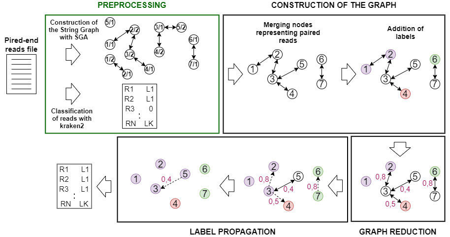

# ClassGraph
ClassGraph is a tool that classifies metagenomic reads starting from the output of other pre-existing binning tools

Current technologies allow the sequencing of microbial communities directly from the environment without prior culturing. One of the major problems when analyzing a microbial sample is to taxonomically annotate its reads to identify the species it contains. Most of the methods currently available focus on the classification of reads using a set of reference genomes and their k-mers. While in terms of precision these methods have reached percentages of correctness close to perfection, in terms of recall (the actual number of classified reads) the performances fall at around 50%. One of the reasons is the fact that the sequences in a sample can be very different from the corresponding reference genome. To address this issue, we propose ClassGraph, a new binning  method  that  makes  use  of  the  reads  overlap  graph  and  applies  a label propagation algorithm to refine the binning result of existing tools.

<p align="center">
  
</p>

## ClassGraph Download
It's possible to download ClassGraph by cloning the repository in your machine.

```
git clone https://github.com/MargheritaCavattoni/ClassGraph.git
```
## Installation
The istallation of ClassGraph requires python 3.6 or above. Besides the following dependency is needed:
* [python-igraph](https://igraph.org/python/)

### Installing with Conda
It's possible to use [Conda](https://docs.conda.io/en/latest/) in order to set-up the proper environment of ClassGraph. [Anaconda](https://www.anaconda.com/distribution/) or [Miniconda](https://docs.conda.io/en/latest/miniconda.html) contain Conda.

In order to create the Conda environment and activate it run the following commands:
```
conda env create -f environment.yml
conda activate ClassGraph
```

## Preprocessing
ClassGraph requires two input files: one representing a graph of reads and the other containing the result of the classification process. The labelles assigned to the reads by the pre-existing binning tool will be propagated over the graph to the still unclassified reads. ClassGraph is thought to be used with paired-end reads.

### Overlap Graph
The graph must be composed as follows: the nodes represent the reads and the edges their overlaps. The file must be presented in asqg format.
One possible tool that satisfies these requirements is [**SGA**](https://github.com/jts/sga) (String Graph Assembler), an assembler based on the overlap-layout-consensus.

### Binning Tools
ClassGraph requires as input the result of the classification process presented as follows:
```
NODE_1,L1
NODE_2,L1
NODE_3,L1
NODE_4,L2
NODE_5,L2
...
```
Where NODE_i is the node ID and Li represents its label. Li must be equal to 0 if the read wasn't classified.
Hypothetically any metagenomic binning tool could be used for the classification. During the testing we decided to use [**kraken2**](https://github.com/DerrickWood/kraken2.git), since it's one of the best performing.

## Usage Example
In order to run ReadGraph it's necessary to type on the terminal a command structured as follows:
```
python3 ClassGraph.py --graph $Assembler_DIR/Graph.asqg --output $ClassGraph_Output_DIR/ --binned $Classifier_DIR/BinnedReads.out --prefix example1 --max_iteration 20
```
Where:
* --graph           path to the graph file (asgg)
* --output          path to the folder where we want to store the output
* --binned          path to the file that stores the result of the initial classification with a preexisting binning tool
* --prefix          name of the output file
* --max_iteration   maximum number of iterations in the label propagation algorithm

## Getting help
If you encounter bugs or have further questions or requests, you can raise an issue at the issue page. You can also contact Margherita Cavattoni at cavattonimargherita@gmail.com

## Citation
M. Cavattoni, M. Comin,
*"Boosting Metagenomic Classification with Reads Overlap Graph"*,
Under submission at the [7th-8th International Conference on Algorithms for Computational Biology](https://irdta.eu/alcob2020-2021/)
