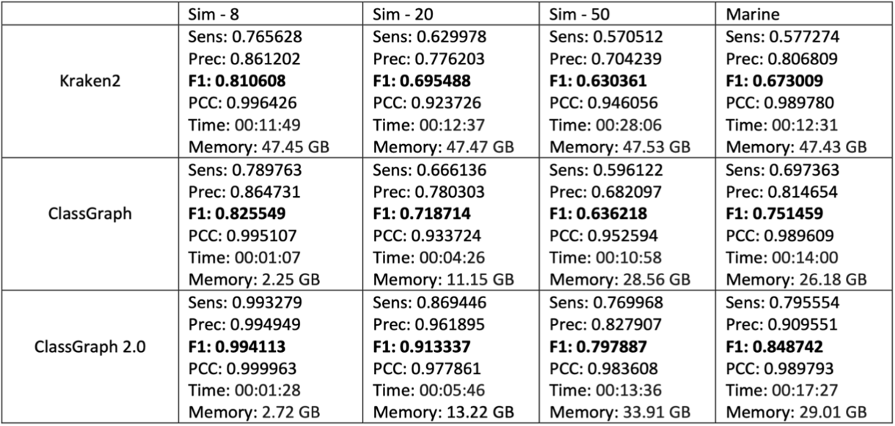

# ClassGraph2

Motivation:

Current technologies allow the sequencing of microbial communities directly from the environment without prior culturing. The major problem
when analyzing a metagenomic sample is to taxonomically annotate its reads
to identify the species they contain. Most of the methods currently available
focus on the classification of reads using a set of reference genomes and their
k-mers. While in terms of precision these methods have reached percentages of
correctness close to perfection, in terms of recall (the actual number of classified
reads) the performances fall at around 50%. One of the reasons is the fact that
the sequences in a sample can be very different from the corresponding reference
genome, e.g. viral genomes are highly mutated.

Methods:

To address this problem, in this paper we propose ClassGraph2,
a metagenomic taxonomy refinement tool that makes use of reads overlap information from the reads overlap graph, to refine the results of existing tools to classify unlabelled reads. ClassGraph2 needs two types of input: one is the
reads overlap graph and the other is the output of a binning tool. At this stage
the graph is stored in a data structure, where to each vertex/read is associated
a label given by the binning tool. The arcs in the graph are weighted based
on the overlap of the two reads. Under the assumption that connected reads
are more likely to be from the same species, we refine the vertex labels in the
reads overlap graph. This procedure is performed to search for nodes that are
mislabelled by the binning tool. To do this, a RefineLabel algorithm is used,
which can eliminate incorrectly assigned labels, followed by a LabelPropagation
algorithm that expands the correct labels. The RefineLabel algorithm counts
neighboring nodes with the same label as the node under examination. If the
label of the node is different from most of the labels of neighboring nodes, then
this label must be removed. Once all nodes have been processed, the labels are
deleted. In the label propagation phase each labeled node sends its label to
its neighbor, along with the weight of the arc connecting the two nodes. The
receiving node will choose its label maximizing the score of the associated arcs.

Results:

We tested ClassGraph2 on three simulated datasets of long reads,
created using SimLoRD with 8, 20 and 50 species as in [cite], and a real marine metagenome with 5000 species, from the CAMI2 challenge, for which the
ground truth is known. We chose Kraken2, which is the state of the art, for the
taxonomic classification of reads. We compared the classification performance
of Kraken2 with ClassGraph and ClassGraph2. Sensitivity, precision, F1-Score
and PCC were used to assess the accuracy of the classifications. Instead, time
and memory were used to assess the running costs of the tools.

From the results in the Figure

  

it can be seen that after running ClassGraph the classification accuracy, in terms of F-measure, for all datasets increases slightly, mostly due to a better sensitivity. With ClassGraph2 there is a further increase in the classification accuracy for all datasets, with a substantial
increase of both sensitivity and precision. From the results it can be observed
that, although Kraken2 is one of the best binning tools, it cannot classify all
reads, in fact the sensitivity on the most complex datasets is 57%, and the
precision ranges in [70%-80%]. With ClassGraph, and its Label Propagation algorithm, these labels can be expanded, increasing the number of classified reads,
while preserving a similar precision. In ClassGraph2, with the new Refine Label
algorithm before the Label Propagation, the classification accuracy further increases. The performance of ClassGraph2 shows that some of the classifications
produced by Kraken2 are incorrect, but it is possible to recognise them and then
expand only the correct ones, thus improving both sensitivity and precision. It
can also be seen that the execution times of Kraken2 and ClassGraph2 are of
the same order of magnitude. The memory required to run ClassGraph2 is less
than that required to run Kraken2.

<embed src="Supplementary_information_BITS_ClassGraph2.pdf" type="application/pdf">
